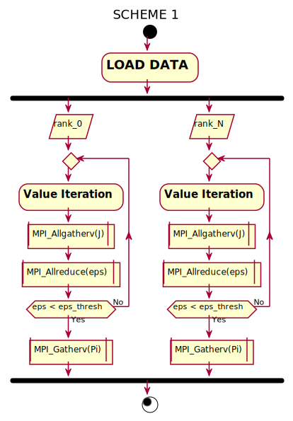
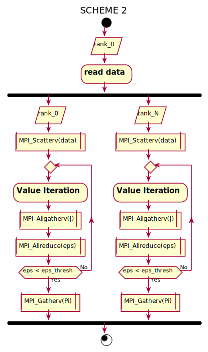
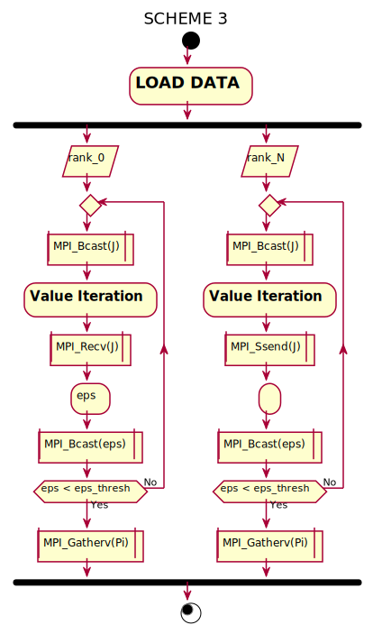
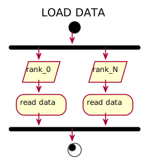
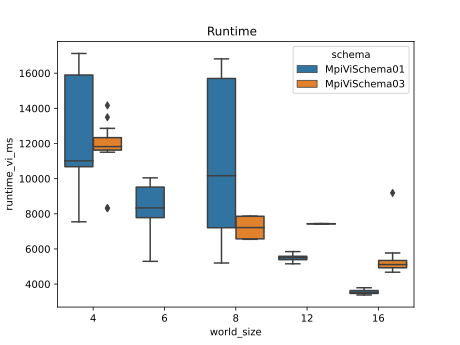
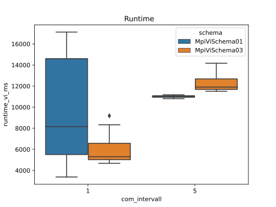

# MPI applied to Value Iteration, HPCfMI WS20/21, Group 3
Tobias Krug, Tobias Klama, Till Hülder

This project is part of the course High Performance Computing for Machine Intelligence. It is used to evaluate different Open MPi communication schemes.

## Measurement objectives
Possible measurements:
  - execution time (total, per block)
  - iterations until convergence
  - memory usage (RAM)


Possible variatiation points:
  - MPI schemes 
  - MPI synchronization intervall (cycles)
  - MPI processor count
  - computing hardware (HPC class 1, HPC class 2, RPi cluster, NUC cluster)
  - asynchronous vs. synchronous VI with OpenMP
  - 
## Scheme 
  The following schemes can be executed:

  
  
  

 The dataloading ist done in the following :

  


## Using the project
The project can be executed using the make commands listed below.

# Procedure
**init**
Downloads the dataset and prepares it for cpp.
**test**
Checks integrity of data in /var/tmp/user/ and the downloaded data.
In /automation/jobs/ lay yaml files with the desired parameters/configuration.

# Makefile

- **clean**:
  - Cleans repository and removes build files.
- **rebuild: clean**: 
  - Get rid of everything that might be left and then compile from scratch
- **compile**: 
  - **clean**
  - doxygen
  - builds project
- **init**:
  - updates submodules
  - checks and installs neccessary packages
  - downloads data-set from strato server
  - prepares data-set according to _preparedata.py_
- **build:**
  - build Project
- **preTest:**
   - Synchronize data set from home drive to /var/tmp/
- **postTest**:
   - Synchronize esults directory to server
- **prepareTarget**:
   - Prepare Target for execution
- **testTarget**:
  - Run test 
- **prepareHpcClassA**:
  - Prepare HPC CLass A (hpc01 - hpc04) for execution
- **testHpcClassA**:
  - Run test PC CLass A (hpc01 - hpc04) with parameter number of runs and number of processors on target
- **_testHpcClassATarget**:
  - Run test PC CLass A (hpc01 - hpc04) with parameter number of runs and number of processors
- **prepareHpcClassB**:
  - Prepare HPC CLass B (hpc06 - hpc15) for execution
- **testHpcClassB**:
  - Run test PC CLass B (hpc06 - hpc15) with parameter number of runs and number of processors on target
- **_testHpcClassBTarget**:
  - Run test PC CLass B (hpc06 - hpc15) with parameter number of runs and number of processors
- **prepareNuc**:
  - Prepare Nuc for execution
- **testNuc:**
  - Run test on Nuc
- **report**:
  - makes latex report
- **pack**:
  - **clean**
  - packs project
- **unpack**:
  - unpacks project
- **all**:
  -  dummy to prevent running make without explicit target

### Running tests
#### Preconditions
This project assumes certain infrastructure to be available on the targets used for testing. First and foremost, that is make. To yield a working installation of the project, you have to options:
1) make the complete project available in the target location, log-in via ssh and execute the following commands from the top-level directory of the project: 
```bash
sudo apt install make
make setupToolchain
```
2) log-in via ssh and execute the following block (check utl/init.sh for latest version):
```bash
# setup routine
echo "> entering setup routine"
## apt packages, apapted from https://stackoverflow.com/questions/10608004/auto-install-packages-from-inside-makefile
echo ">> installing debian packages with apt"
### misc.
if ! dpkg -l | grep git -c >>/dev/null; then sudo apt-get install git; fi
if ! dpkg -l | grep make -c >>/dev/null; then sudo apt-get install make; fi
if ! dpkg -l | grep cmake -c >>/dev/null; then sudo apt-get install cmake; fi
if ! dpkg -l | grep doxygen -c >>/dev/null; then sudo apt-get install doxygen; fi
if ! dpkg -l | grep liblapack-dev -c >>/dev/null; then sudo apt-get install liblapack-dev; fi
if ! dpkg -l | grep liblapacke-dev -c >>/dev/null; then sudo apt-get install liblapacke-dev; fi
if ! dpkg -l | grep graphviz -c >>/dev/null; then sudo apt-get install graphviz; fi
if ! dpkg -l | grep python3-pip -c >>/dev/null; then sudo apt-get install python3-pip; fi
### openmpi
if ! dpkg -l | grep openmpi-bin -c >>/dev/null; then sudo apt-get install openmpi-bin; fi
if ! dpkg -l | grep openmpi-common -c >>/dev/null; then sudo apt-get install openmpi-common; fi
if ! dpkg -l | grep libopenmpi-dev -c >>/dev/null; then sudo apt-get install libopenmpi-dev; fi

## pip packages
echo ">> installing python packages with pip"
pip3 install pytest cffi numpy scipy matplotlib pandas seaborn
```
### Visualization
the reading of the measurement data can be done via the  /gruppe-3-hauptprojekt/automation/results/HEAD/readVisual.py file. Here are different visualization tools available. This can look like the following.




