[](https://github.com/hashkode/hpcfmi-mpivi/actions/workflows/c-cpp.yml)

# MPI applied to Value Iteration, HPCfMI WS21/22, Group 3
Tobias Krug, Tobias Klama, Till Hülder

This project is part of the course High Performance Computing for Machine Intelligence. It is used to evaluate different Open MPI communication schemes. Each scheme implements a different way of yielding an optimal solution to a space navigation problem with asynchronous value iteration. (if more than one processor is involved)

## MPI architecture
To ease the implementation burden for new schemas, a schema base class is introduced. The actual schema implementations inherit from as depicted in the following UML diagram.


### Schemes
As of now, three schemes are implemented and can be tested via configuration. The following sections introduces the communication layout and mechanisms of the layouts. All schemes operate on configuration specified as .yaml file, whose path has to be given as a command line parameter to the binary. Actual availability of the configuration file is only required on the root node running the rank0 processor. This one broadcasts the configuration after a successful loading and parsing to all other MPI nodoes. 

| **Schema** | MpiViSchema01 | MpiViSchema02 | MpiViSchema03 |
|---|---|---|---|
| **Key concept** | Distributed calculation of J, exchange of J via broadcast, synchronised calculation of epsGlobal as convergence criterion. | Distributed calculation of J based on subset of data without access to data files for ranks other than rank_0, exchange of J via accumulation at every rank, synchronised calculation of epsGlobal as convergence criterion. | Distributed calculation of J, exchange of J via accumulation at rank_0, synchronised calculation of epsGlobal as convergence criterion. |
| **PlantUML** |  |  | 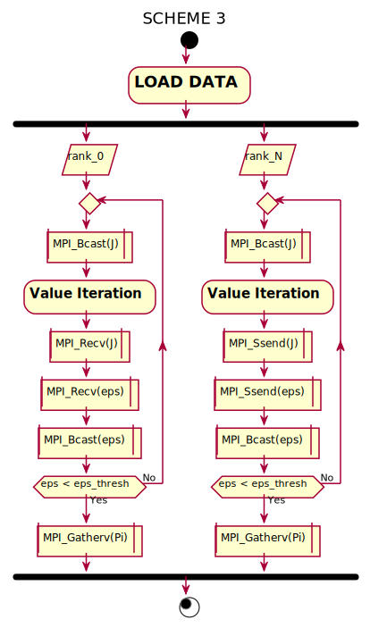 |

Some schemes rely on local availability of the data sets, these schemes execute the following sub-scheme as referenced above.


## Software, methods and tools
This project is implemented using a set of software tools, namely:
- CLion from JetBrains for C++/Python development
- Sublime Merge from Sublime for professional git usage

Concerning infrastructure, the project depends on
- HiDrive from Strato for exchange of measurement files and easy distribution of data sets

and supports
- continuous integration, continuous testing and even continuous deployment via GitHub actions.
 
Deployment is not activated by default, as it would require a sshkey for the TUM HPC cluster on GitHub. This is considered unsafe and is therefore not realised.

The team worked together in a SCRUM style fashion based on issues and a per-issue branch and merge-request.

# Makefile
The project can be executed using the make commands listed below.
## General make targets
- all
  - dummy target to prevent make without target
- setupToolchain
  - Setup minimum target toolchain, install packages
- setupHostToolchain
  - Setup complete host toolchain, install packages, retrieve latest data set and prepare it for testing
- init
  - Initialize the data set on the host machine
- clean
  - Remove generated files, build output and related files
- rebuild
  - Run a clean build/rebuild of the project
- build
  - Run an incremental build of the project
## Development make targets for local development and tests
- test
  - Execute a local test cycle with build and one iteration.
- testX
  - Execute a local test cycle with build and multiple iterations. Use as follows to tun 5 cycles:
    ```bash
    make testX nruns=5
    ```
- generateDoxygen
  - Generate the Doxygen documentation for the project and used libraries.
- documentation
  - Generate the PlantUML and measurement graphics used in this readme and the report. Generate the report. Stash all generated files.
- pack
  - Prepare a tarball for easy sharing of the project.
- unpack
  - Unpack a project tarball retrieved from somewhere else.
## Remote test make targets for all implemented targets
- runAllHpcTests
  - Execute all TUM HPC standard tests
- runHpcATests
  - Execute TUM HPC Class A standard tests
- runHpcBTests
  - Execute TUM HPC Class B standard tests
- runHpcMixedTests
  - Execute TUM HPC Class Mixed standard tests
- runNucTests
  - Execute all NUC standard tests
- runRpiTests
  - Execute all Raspberry Pi standard tests
- runLocalTests
  - Execute all Local standard tests
- runCITests
  - Execute all CI standard tests 

# Running tests
## Preconditions
This project assumes certain infrastructure to be available on the targets used for testing. First and foremost, that is make. To yield a working installation of the project, you have to execute two steps:
1) On your host machine:
  - make the complete project available
  - execute the following commands from the top-level directory of the project: 
```bash
sudo apt install make
sudo make setupHostToolchain
```
2) On all your target machines:
  - make the complete project available on the target
  - log-in via ssh and execute the following commands from the top-level directory of the project: 
```bash
sudo apt install make
sudo make setupToolchain
```

# Measurement objectives
## Measured parameters
- execution time (total, vi)
- iterations until convergence
- memory usage (RAM) (max at rank0; sum, min, max of all nodes)
- quality of VI solution (max norm, l2 norm, MSE)

## Possible variation points
- data set
- MPI target (TUM HPC Class A, TUM HPC Class B, TUM HPC Class Mixed, NUC cluster, Raspberry Pi cluster)
- MPI scheme
- MPI parameters
  - MPI synchronization intervall (cycles)
  - MPI processor count (world_size)
- VI parameters
- asynchronous vs. synchronous VI with OpenMP

## Visualization
The below graphs visualize the collected measurement files and their analysis per data set and target.

### Small dataset

| Target:                     |HPC Class A|HPC Class B|HPC Class Mixed|NUC|RPi|Local|
|-----------------------------|---|---|---|---|---|---|
| runtime_vi_ms vs. world_size       |||||||
| runtime_vi_ms vs. com_interval     |||||||
| rss_max_rank0_kb vs. world_size |||||||
| rss_sum_all_kb vs. world_size   |||||||
| steps_total vs. world_size         |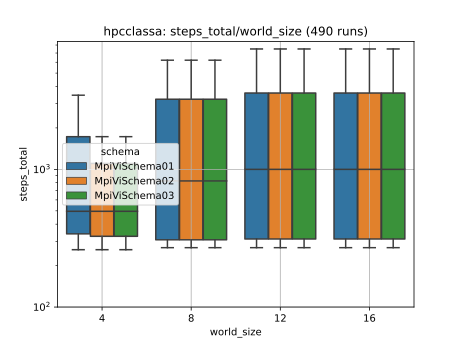|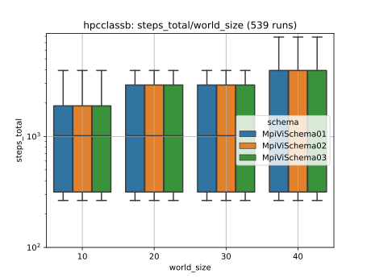||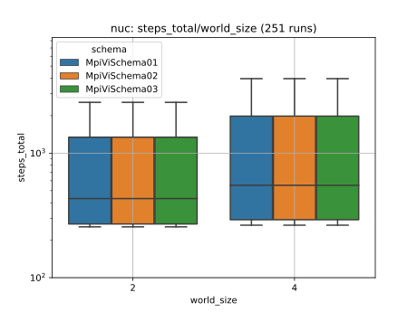||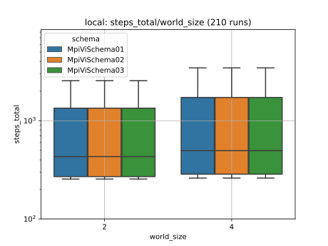|
| steps_total vs. com_interval       |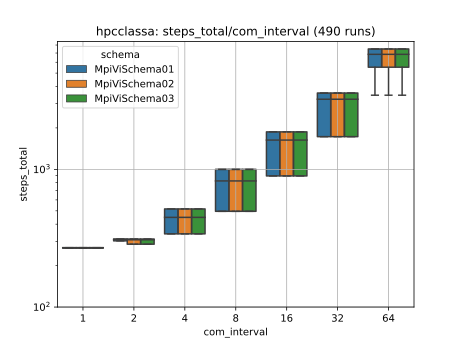|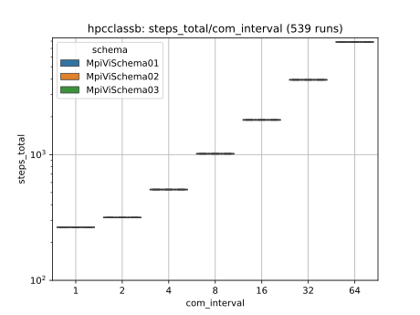|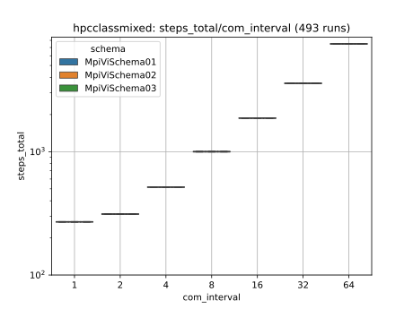|||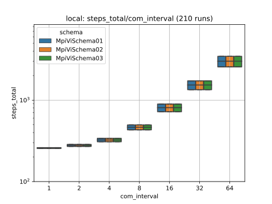|
| jdiff_maxnorm vs. world_size       ||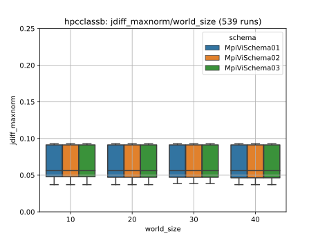|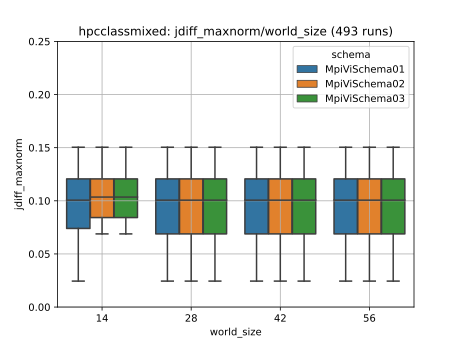|||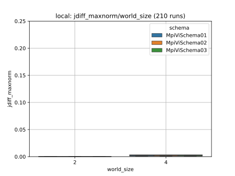|
| jdiff_maxnorm vs. com_interval       ||||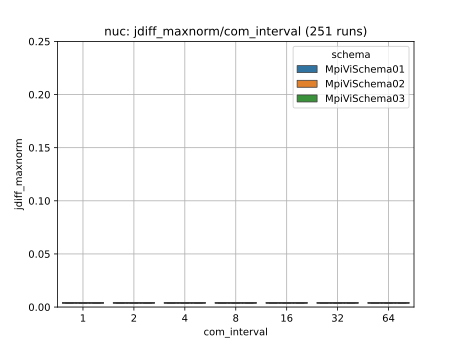||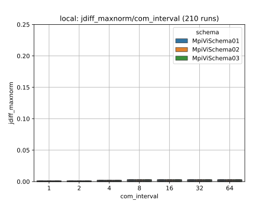|

### Normal dataset

| Target:                     |HPC Class A|HPC Class B|HPC Class Mixed|NUC|RPi|Local|
|-----------------------------|---|---|---|---|---|---|
| runtime_vi_ms vs. world_size       |||||||
| runtime_vi_ms vs. com_interval     |||||||
| rss_max_rank0_kb vs. world_size |||||||
| rss_sum_all_kb vs. world_size   |||||||
| steps_total vs. world_size         |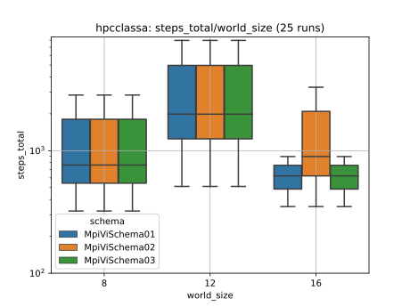|||||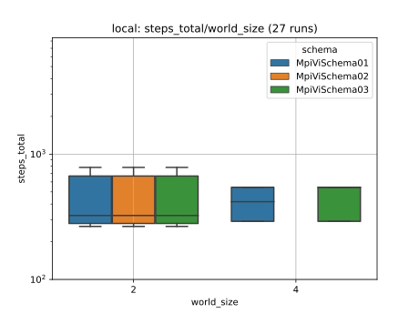|
| jdiff_maxnorm vs. world_size       ||||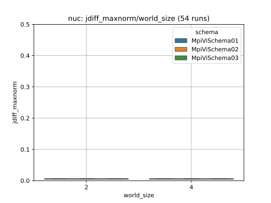|||
| jdiff_maxnorm vs. com_interval       |||||||
